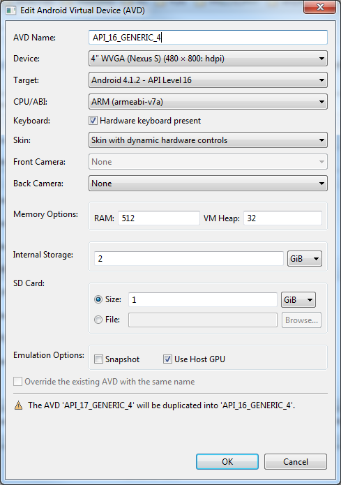

Tools 
=====

In this section you can find details about various tools that are used during the development process. To work with the app you will need to know how to setup Android Emulators and also how to configure your IDE. 

You should read through the [advanced section](http://developer.xamarin.com/guides/android/advanced_topics/) on the Xamarin website to help you understand the build process and configuration options mentioned below. 

### Android Virtual Device (Emulator) Configuration

Below is a list of emulator configurations that you can use during development and development testing. As well as the emulator, you should run the app on a at least one real device before completing a feature. 

####Development Emulator:

This is my default emulator which I use on a day-to-day basis. It is optimised to be responsive a the expense of running a slightly different config than a production Android device (it uses X86 CPU instead of ARM). It also runs Android Lollipop (v21) which is the highest OS version will need to support for a while.  

####Development Testing Emulator:

This emulator is closer to a production device as it emulates an ARM CPU. It has only 512MB of RAM and a heap size of 32MB - which is low but is good for testing that we can still run the app on bare minimum specs. It runs Jelly Bean (v16) which is the lowest OS version that will be targeting. You should do some testing on this emulator before completing your feature. 

######General Info

- Don't use more than 768m of RAM or a larger heap than 64m. Allocating too memory might hide some bugs in your code. Using more than 768m of RAM in Windows is also known to be problematic. 
- Make sure "Use Host GPU" is ticked. This offloads some of the graphics processing to your workstation's GPU. 
- Use the Intel Atom CPU and alow with Intel's virtualization optimisation (HAX - see below). This allows you to run Android with your workstations CPU, rather than have it emulate the ARM CPU normally found on Android devices. This make things are lot quicker. When using the Intel X86 or X86_64 CPU, you also need to make sure you build the APK so that it supports this architecture (see Visual Studio configuration below). **You should only use this in the dev or debug project configurations** - for production only the ARM architecture is currently supported. This is explained more below in the Visual Studio configuration section. 

#### Installing HAX Optimistation

You can install a small tool from Intel (if you are running an Intel chip on your workstation). You do this through the SDK Manager as shown below. Once downloaded it will be stored in <sdk home>\extras\intel\Hardware_Accelerated_Execution_Manager. Double click the installer and follow the instructions. You may also need to change a setting in your BIOS to enable this optimisation. With HAX installed, you can run Android emulators with the Intel Atom CPU and they will be a lot quicker than 
emulating the ARM CPUs. 

###Visual Studio Configuration

Visual Studio's configuration files are checked in to the repository so these options should already be set when you open the project. To access these settings in Visual Studio you can click on PROJECT > Distributr.Mobile Properties

####Development Configuration

**Note** in the advanced config that x86_64 is checked. This means we are targeting a 64 Bit CPU (for a 64 bit workstation). This matches the CPU/ABI config from the development emulator above. It is only appropriate for development. 

####Release Configuration

This is the configuration that you should use for a release when targeting a real Android device (and the one that we will use on the continuous integration server). The packaging and linking are the same as above, but note the supported architecture is now armeabi-v7a. This is the only architecture that should be checked. Any other included architectures will increase the APK file size. In future we may also need to check arm64-v8a which will be used by devices with 64-bit CPUs (currently only the nexus 9 uses a 64-bit CPU though they will be more common in future). 

###Android Monitor

Android Monitor provides a way to view Log Cat messages as well as bunch of other features which are useful for debigging, such as view threads, generating a heap dump and monitor memory and CPU. You can launch Android monitor from <sdk home>/tools/monotor.bat
